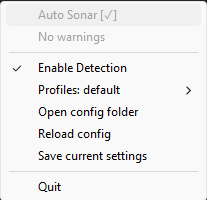

# steelseries-gg-py
An API for interfacing with various apps in SteelSeries GG.

Currently, support is limited to the Sonar and Engine endpoints for audio control, as those are the features available with my SteelSeries headset.

Most endpoints include dedicated function calls for reading and updating data. However, for Sonar control, the  write_sonar and read_sonar functions are the easiest way to access most of the sonar settings with minimal api calls.


>from steelseries-gg-py import GG
>gg=GG(coreProps_path='C:\\ProgramData\\SteelSeries\\SteelSeries Engine 3\\coreProps.json')
>data=gg.read_sonar()
>gg.write_sonar(data)

## sonar dictionary
### streamerMode
* An optional entry to force the streamer mdoe of sonar. if not set it will leave it to what its currently set as
* Arguments that are streamer/classic only will not be applied when in the correct mode to avoid issues
* bool: true is streamer mode
* str: "toggle" to toggle it based on current setting
### eq
* channels
  * sets the eq for the selected channel using the display name
  * str: matching the case of the wanted eq
### volume/monitoringVolume/streamingVolume
* channels
  * sets the volume of the selected channel
  * input is clamped between 0 and 1
  * float: 0=0% -> 1=100%
  * str: "r-0.1" to relatively move the volume up or down
### mute/monitoringMute/streamingMute
* channels
  * sets the volume of the selected channel
  * bool: false to mute
  * str: "toggle" to toggle it based on current setting
### streamingRedirection/monitoringRedirection
* channels
  * sets whether each channel is muted for the stream or monitor device
  * bool: False to mute
  * str: "toggle" to toggle it baed on current setting
* deviceId
  * sets the output device for
  * str: windows device ID
### micRedirection
* deviceId
  * sets the output device for
  * str: windows device ID
### audioInitialization
* channels
  * enables or disables the virtual devices for the selected channel
  * bool: true is enabled
  * str: "toggle" to toggle it baed on current setting
### streamMonitoring
* mirrors the stream channel to the monitoring channel
* bool: true to mirror
* str: "toggle" to toggle it based on current setting
### channel
* sets the pid entered in the write_sonar function to output to that channel
* str: channel name
### speaker
* sets the default windows device to the target channel allowing for control using volume nobs on keyboards or other devices
* str: channel name
### chatMix
* progressively lowers the volume of the game or chat channel
* float: -1=No chat -> 0=balanced -> 1=No game
#### Example Classic Dict
```json
{
  "streamerMode": false,
  "eq": {
    "allRender": "Flat"
  },
  "volume": {
    "allRender": 1.0,
    "chatRender": 0.75,
    "media": 0.5,
    "aux": 0,
    "chatCapture": 0.5
  },
  "mute": {
    "all":false,
    "aux": true
  },
  "redirection": {
    "allRender": "{0.0.0.00000000}.{318083ea-3e25-4187-ab53-80597d9abcd9}",
    "mic": "{0.0.1.00000000}.{c546c47d-c76c-4b8c-ba7c-70e3509e4b8e}"
  },
  "channel": "game",
  "speaker": "media",
  "chatMix": 0
}
```
### Example Streamer Dict
```json
{
  "streamerMode": true,
  "streamMonitoring": false,
  "streamingRedirection": {
    "deviceId": "{0.0.0.00000000}.{0b707a69-1b89-49d5-a10b-46483c52f978}",
    "all": false,
    "media": true,
    "chatCapture": true
  },
  "monitoringRedirection": {
    "deviceId": "{0.0.0.00000000}.{318083ea-3e25-4187-ab53-80597d9abcd9}",
    "allRender": true,
    "game": true,
    "media": true,
    "aux": true,
    "chatCapture": false
  },
  "micRedirection": {
    "deviceId": "{0.0.1.00000000}.{c546c47d-c76c-4b8c-ba7c-70e3509e4b8e}"
  },
  "eq": {
    "all": "Flat"
  },
  "monitoringVolume": {
    "allRender": 1.0,
    "chatCapture": 1.0
  },
  "streamingVolume": {
    "all": 1.0
  },
  "monitoringMute": {
    "allRender": true,
    "chatCapture": false
  },
  "streamingMute": {
    "all": false
  },
  "channel": "game",
  "speaker": "game"
}
```

# Auto_Sonar
This is a application that allows for the automatic swapping of sonar settings based on active application.
It allows for changing settings based on the active application based on the process name or the folder
## Use
Create a shortcut in your startup folder with the below target to automaticalling start the script on startup
> path\pythonw.exe "path\auto_sonar.py

After launching the application you will get a headphone icon in the system tray.  
  
Right clicking on it will open the settings menu.  

* Enable Detection
  * Toggles the automatic profile swapping on or off
* Profiles:
  * Displays the currently active profile
  * Allows for the manual override by selecting another profile
    * selecting a profile will disable automatic detection
* Open Config Folder
  * Opens the folder containing the logs and the config.json
* Reload config
  * Relods the config file from the json to implement any edits
* Save current settings
  * Creates a new profile with a copy all the current settings in the fonfig file
    * This profile can be modified by the user to delete any unwanted settings changes
* Quit
  * Closes the application

## Config Structure
### poll_interval_ms
* float: time between each check of the active application in ms.
### app_detection_enabled
* bool: enables or disables the automatic detection on startup.
### coreProps_path
* str|None: Overwrites the default coreprops path if its installed in a different location.
### profiles
* dict: contains all the values for the specified profile
#### color
* Either a single string hex color or a list of 2 string hex colors.
  * If two colors are provided the first will be the be the color of the drivers and the second will be the headband
* str: color
* tuple[str,str]: [driver color,headband color]
#### description
* str: simple description of the profiles
#### folders
* will match the given string to the current active exe path
* paths will be evaluated so you can use environment variables such as "%LOCALAPPDATA%
* tuple[str]: all the folders to match
#### names
* matched to the executable name for the active application
* tuple[str]: all the names to match
#### channel
* this will move any application detected under this profile to the matching channel for automatic swapping 
* str: channel name
#### sonar
* this is a dict that contains the write_sonar dict format shown above in [GG dicts](#sonar-dictionary)
### example
```json
{
  "poll_interval_ms": 1000,
  "app_detection_enabled": true,
  "coreProps_path": null,
  "profiles": {
    "default": {
      "color": [
        "#A94DC1",
        "#bb78cc"
      ],
      "description": "Default profile",
      "sonar": {
        "eq": {
          "game": "Flat"
        },
        "channel": "media",
        "speaker": "media"
      }
    },
    "R6S": {
      "folders": [
        "AppData\\Local\\Ubisoft\\r6s",
        "Steam\\steamapps\\common\\Tom Clancy's Rainbow Six Siege"
      ],
      "description": "Rainbow Six Siege",
      "color": [
        "#216460",
        "#88b6b3"
      ],
      "sonar": {
        "eq": {
          "game": "r6s footboost"
        },
        "channel": "game"
      }
    },
    "BF6": {
      "folders": [
        "Steam\\steamapps\\common\\Battlefield 6"
      ],
      "names": [
        "bf6"
      ],
      "description": "BattleField 6",
      "color": [
        "#8dee6d",
        "#57bef8"
      ],
      "sonar": {
        "eq": {
          "game": "bf6 surround"
        },
        "channel": "game"
      }
    },
    "HD2": {
      "folders": [
        "Steam\\steamapps\\common\\Helldivers 2\\"
      ],
      "description": "Helldivers 2",
      "color": [
        "#feea00",
        "#000000"
      ],
      "sonar": {
        "channel": "game"
      }
    }
  }
}
```


